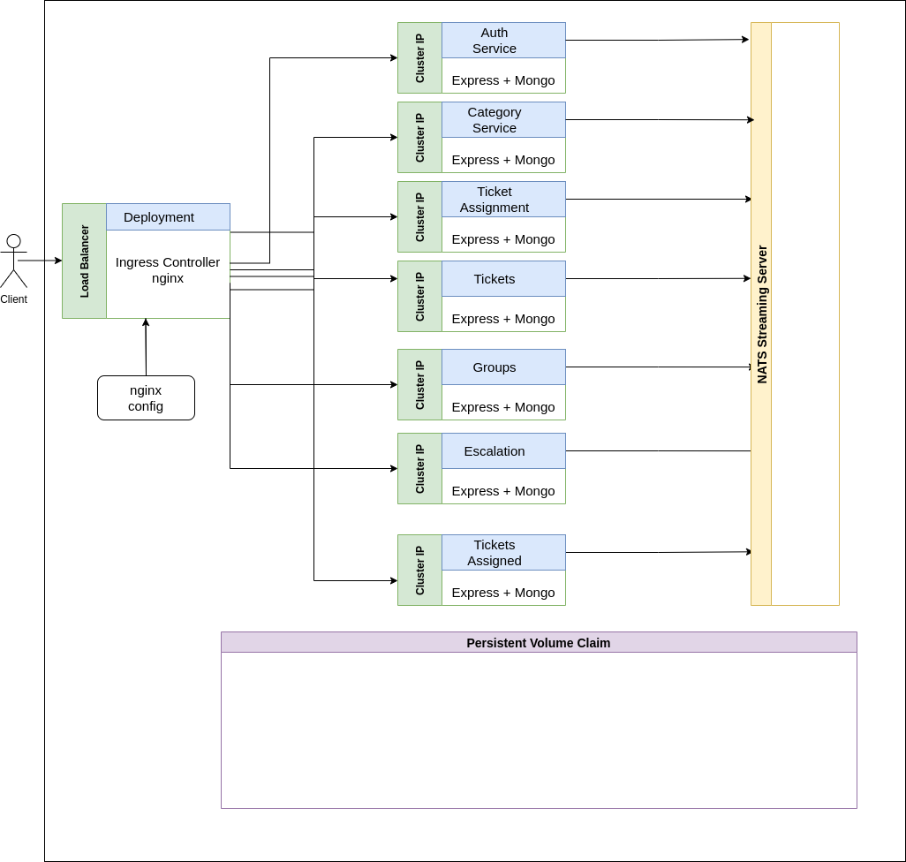

# TS SERVICE DESK

- Microservice architecture for a service desk application.
- Connection to the services is through a LoadBalancer attached to it is a deployment with an ingress configuration with a set of routing rules.

## Cloud Provider

- GCP

## Architecture

## SERVICES

| Service          | Description                                                                                                    | CluterIP Port |
| ---------------- | -------------------------------------------------------------------------------------------------------------- | ------------- |
| Auth             | user module to handle sign-in, password reset etc                                                              | 5000          |
| Groups           | These will be attached to categories such that an auto assignment can run on the group attached to a category. | 5001          |
| Category         | ticket categories which will hold the auto-assignment logic                                                    | 5002          |
| Tickets          | Tickets Raised                                                                                                 | 5003          |
| Tickets Assigned | To keep a record of the number of tickets assigned to an agent                                                 | 5004          |
| Auto Assignment  | Run jobs to assign tickets to agents based on a priority queue data structure.                                 | 5005          |
| Escalation       | To handle dynamic escalation matrices which shall be attached to tickets raised.                               | 5006          |

**Services communicate asynchronously with each other through publishing events**

## EVENTS TO BE PUBLISHED AND TO BE LISTENED TO

| Event           | Published By (Service)                    | Listened to By (Service)                                    |
| --------------- | ----------------------------------------- | ----------------------------------------------------------- |
| UserCreated     | User                                      | Auto Assignment, Groups,  Tickets Assigned, Tickets    |
| UserDeleted     | User                                      | Auto Assignment, Groups,  Tickets Assigned, Tickets    |
| UserUpdated     | User                                      | Auto Assignment, Groups,  Tickets Assigned, Tickets    |
| CategoryCreated | Category                                  | Tickets                                                     |
| CategoryUpdated | Category                                  | Tickets                                                     |
| CategoryDeleted | Category                                  | Tickets                                                     |
| TicketCreated   | Ticket                                    | Auto Assignment                                             |
| TicketUpdated   | Ticket, Auto Assignment,  Escalation | Ticket, Auto Assignment,  Escalation, Tickets Assigned |
| TicketDeleted   | Ticket                                    | Ticket, Auto Assignment,  Escalation, Tickets Assigned |
| GroupCreated    | Groups                                    | Category                                                    |
| GroupUpdated    | Groups                                    | Category                                                    |

## Routes

1. Auth Service

| Route                                              | Purpose                                    | Verb        |
| -------------------------------------------------- | ------------------------------------------ | ----------- |
| <code>/api/auth/sign-up</code>                     | Sign Up                                    | <code>POST  |
| <code>/api/auth/login</code>                       | Login                                      | <code>POST  |
| <code>/api/auth/request-reset-token</code>         | Request Password Reset Link on mail        | <code>POST  |
| <code>/api/auth//reset-password/:resetToken</code> | Resets password with the provided password | <code>PATCH |
| <code>/api/auth//modify-user/:userId</code>        | Modify User Role by Admin                  | <code>PATCH |

2. Groups Service

| Route                                       | Purpose                   | Verb        |
| ------------------------------------------- | ------------------------- | ----------- |
| <code>/api/groups</code>                    | Fetch Groups              | <code>GET   |
| <code>/api/groups/new</code>                | Create New Group          | <code>POST  |
| <code>/api/groups/:groupId/add-users</code> | Add Users to a Group      | <code>PATCH |
| <code>/api/groups/:groupId/add-users</code> | Remove Users from a Group | <code>PATCH |

3. Categories Service

| Route                                  | Purpose             | Verb         |
| -------------------------------------- | ------------------- | ------------ |
| <code>/api/category</code>             | Fetch Categories    | <code>GET    |
| <code>/api/category/new</code>         | Create New Category | <code>POST   |
| <code>/api/category/:categoryId</code> | Update a category   | <code>PATCH  |
| <code>/api/category/:categoryId</code> | Delete a category   | <code>DELETE |

**_Ticket Assignment is attached to a category, the assignment options can be either be:_**

- Yes, assign to any user.
- Yes, assign to specific users - specific users are found in the group attached to a category.
- No - Auto assigment is not perfomed in this category. Tickets are manually assigned

## TECHNOLOGIES USED

- Node js
- Express
- Mongo DB
- Typescript
- Redis
- Nats Streaming Server
- Docker
- Kubernetes

_To update the README as the application continues._

## Manual Acceptance Testing

- Sign up (should be via a magic link on mail - default account is admin on sign up ) to settle for POSTMAN for now.
- Check if event was publsihed to create a new user in Group Service.
- This admin account should be able to add more users into the system ( default password - 123456, should be changed on login).
- Users with Agent roles when added by this admin, Auth Service publishes UserCreatedEvent, which is listened to by Groups Service.
- Create a new group - (add users to this group from the duplicated DB found in groups service).

## License

#### Copyright (c) 2022 Shadrack Adwera

#### Licenced under the [MIT License](LICENCE)
